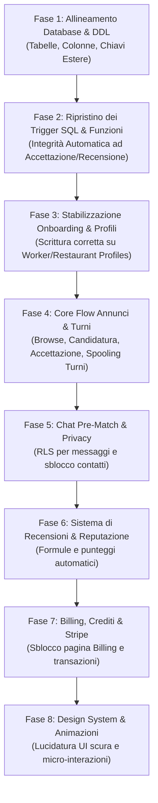

# MASTER_PUPILLO_REBUILD_PLAN.md - Piano d'Orchestrazione per Pupillo V2

Questo documento definisce la visione strategica, le linee guida architetturali, i rischi e l'ordine corretto degli interventi per la ricostruzione stabile e potenziata di **Pupillo V2**. La strategia mira a fondere la modernità dello stack attuale con l'estrema ricchezza funzionale ed integrità transazionale del vecchio sistema.

---

## 1. Visione del Nuovo Pupillo V2

Pupillo V2 si posiziona come **l'ecosistema leader per il lavoro extra meritocratico e autonomo nel settore HoReCa**. 

La piattaforma deve offrire:
1. **Immediatezza**: Matching istantaneo tra ristoratori in emergenza di personale e lavoratori qualificati pronti a lavorare.
2. **Meritocrazia Certificata**: Un calcolo reputazionale accurato e automatico che sanzioni severamente i no-show (mancata presentazione) e premi la puntualità e la professionalità con badge dedicati (**Basic**, **Pro**, **Elite**).
3. **Sicurezza e Privacy**: RLS (Row Level Security) impenetrabile, sblocco dei contatti telefonici solo a match confermato, e gestione rigorosa dei segreti ambientali.
4. **Fatturazione e Flessibilità**: Un modello di monetizzazione misto Stripe (abbonamenti ristoratori) e crediti a consumo, con riscontro immediato nello storico transazioni.

---

## 2. Cosa Mantenere del Progetto Attuale (V2 Staging)

L'attuale codebase di Staging costituisce un'ottima base strutturale ed estetica che deve essere assolutamente preservata:
* **Stack Next.js 14 (App Router)**: Il framework moderno basato su cartelle `/app`, React Server Components e routing dinamico rappresenta lo standard eccellente per la scalabilità e le performance SEO.
* **Aestetica Premium Dark (`bg-slate-950`)**: Il tema scuro profondo, la scelta di gradienti coordinati (Teal $\to$ Emerald) e le micro-interazioni tattili sui pulsanti offrono un'esperienza utente moderna e di alto profilo.
* **Integrazione della Mappa (Leaflet)**: L'integrazione di Leaflet in `/mappa` con indicatori personalizzati è un elemento di fortissimo valore visivo e funzionale per l'esplorazione geografica dei turni.
* **Database Schema Normalizzato (Split Design)**: La scelta di dividere i profili utente in tre tabelle (`profiles`, `worker_profiles`, `restaurant_profiles`) in relazione 1:1 è nettamente superiore dal punto di vista relazionale rispetto alla tabella unica legacy da oltre 100 colonne.

---

## 3. Cosa Recuperare dal Vecchio Pupillo (Lovable Backup)

Il vecchio progetto era notevolmente più maturo per quanto riguarda la logica di business a livello di database. Dobbiamo recuperare:
* **Logiche di Transazione Crediti & Stripe**: Il sistema completo di acquisto crediti, rimborsi per turni annullati, abbonamenti mensili e codici sconto promozionali.
* **Struttura della Chat e Messaggistica**: Lo storico e il motore di messaggistica interna legato alle singole candidature con notifiche istantanee.
* **Calcolo della Reputazione**: Le formule automatiche per calcolare in tempo reale il punteggio medio delle recensioni (`rating_avg`), l'affidabilità percentuale (`reliability_pct`), e la gestione delle sanzioni per no-show.
* **Integrità Transazionale SQL (Trigger PL/pgSQL)**: L'intera suite di trigger di database che automatizzano i passaggi di stato sensibili, prevenendo bypass o stati incoerenti causati da interruzioni di rete sul client.

---

## 4. Priorità di Prodotto e Tecniche

### Priorità Tecniche (Sotto il Cofano)
1. **Riconciliazione del Database**: Aggiungere le tabelle e colonne mancanti al DDL attuale per evitare crash del frontend.
2. **Migrazione dei Trigger SQL**: Ripristinare le automazioni di integrità (es. creazione turno automatico, rifiuto candidati esclusi, aggiornamento della reputazione).
3. **Messa in Sicurezza di Auth & Onboarding**: Allineare il caricamento dei dati onboarding affinché scriva sulle corrette tabelle splittate (`worker_profiles`, `restaurant_profiles`) ed escluda tentativi di scrittura su campi inesistenti di `profiles`.

### Priorità di Prodotto (Esperienza Utente)
1. **Gestione dei Turni Reali (`shifts`)**: Permettere a lavoratori e ristoratori di vedere i turni programmati, marcati come completati, no-show o annullati.
2. **Sblocco Contatti e Chat Funzionante**: Rendere la chat interna pre-match lo strumento principale di contrattazione, con sblocco visivo immediato del numero di telefono solo a match avvenuto.
3. **Billing Funzionante**: Sbloccare la dashboard crediti ed abilitare i pagamenti simulati (Stripe Sandbox).

---

## 5. Analisi dei Rischi Principali

* **Rischio 1: Errori di Query su Tabelle Splittate**: L'attuale frontend esegue scritture ed upsert su `profiles` con campi destinati a `worker_profiles` e `restaurant_profiles`. Questo causerà fallimenti continui delle query in modalità Supabase non-demo.
* **Rischio 2: Perdita di Integrità per Azioni Client-Side**: Affidarsi esclusivamente al frontend Next.js per aggiornare tre tabelle diverse (ad esempio, quando si accetta un candidato) è rischioso. Se l'utente chiude il browser o perde la connessione a metà, il turno risulterà bloccato, ma gli altri candidati non saranno rifiutati.
* **Rischio 3: Fuga di Credenziali (API Keys / service_role)**: Rischio di esporre la chiave amministrativa `service_role` nel frontend per aggirare le policy RLS temporanee. La chiave pubblica `anon` deve rimanere l'unico punto di accesso client.

---

## 6. Ordine Corretto degli Interventi

Per garantire una transizione liscia e priva di regressioni, gli interventi devono seguire un ordine logico sequenziale:

