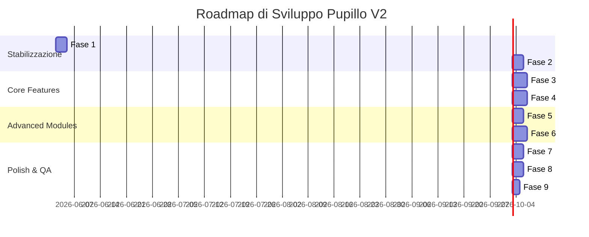

# REBUILD_PHASES.md - Roadmap di Ricostruzione e Stabilizzazione

Questo documento definisce il piano d'azione suddiviso in 9 fasi operative per stabilizzare, riconciliare e perfezionare **Pupillo V2**, assicurando una progressione logica priva di regressioni tecniche.

---

## Roadmap in 9 Fasi

---

## Dettaglio delle Fasi Operative

### Fase 1: Stabilizzazione Auth / Onboarding
*   **Obiettivo**: Garantire che la registrazione, il login e l'onboarding iniziale avvengano in modo fluido senza generare eccezioni SQL.
*   **Attività**:
    *   Ottimizzare `/app/onboarding/page.tsx` affinché separi le scritture: i campi comuni vanno in `profiles`, i dati del lavoratore in `worker_profiles`, i dati del locale in `restaurant_profiles`.
    *   Risolvere la dipendenza da `user_roles` creando temporaneamente la tabella di fallback o gestendo l'eccezione a livello client.

### Fase 2: Riallineamento Database (DDL & RLS)
*   **Obiettivo**: Aggiornare lo schema Supabase di Staging affinché tutte le tabelle richieste dal codice del frontend siano presenti, normalizzate e sicure.
*   **Attività**:
    *   Eseguire lo script SQL DDL per creare le tabelle mancanti: `shifts`, `messages`, `notifications`, `credit_transactions`, `user_roles`, `reviews`.
    *   Configurare le policy di Row Level Security (RLS) su ciascuna nuova tabella per blindare l'accesso ai soli utenti autorizzati.

### Fase 3: Flusso Annunci, Candidature & Turni (`shifts`)
*   **Obiettivo**: Cablare l'intero ciclo di vita di un annuncio di lavoro, dalla pubblicazione all'abbinamento.
*   **Attività**:
    *   Caricare sul database la funzione PL/pgSQL ed associare il trigger `trg_create_shift_on_accept` alla tabella `applications`.
    *   Associare il trigger `trg_reject_other_apps` per l'auto-rifiuto dei candidati esclusi ad accettazione avvenuta.
    *   Creare la dashboard per la consultazione e monitoraggio dei turni programmati (`shifts`) per entrambi i ruoli.

### Fase 4: Chat pre-match, Notifiche & Privacy
*   **Obiettivo**: Abilitare la messaggistica interna e lo scambio sicuro dei contatti.
*   **Attività**:
    *   Configurare i canali in tempo reale su Supabase per la tabella `messages` e `notifications`.
    *   Implementare il trigger `trg_sync_application_last_message` per aggiornare l'anteprima della chat in bacheca.
    *   Sbloccare visualmente il numero di telefono e i contatti sensibili nelle rispettive dashboard solo se lo stato del turno è `accepted` o `scheduled`.

### Fase 5: Recensioni, Reputazione & Incidenti
*   **Obiettivo**: Automatizzare il calcolo della meritocrazia.
*   **Attività**:
    *   Implementare il trigger `trg_create_required_review_on_shift_complete` affinché ad ogni turno concluso con successo venga creata una richiesta di recensione.
    *   Integrare la funzione `recompute_worker_reputation` per aggiornare in tempo reale la media recensioni, l'affidabilità percentuale e le sanzioni per no-show.

### Fase 6: Billing, Crediti & Stripe Integration
*   **Obiettivo**: Abilitare la monetizzazione del servizio.
*   **Attività**:
    *   Sbloccare la pagina `/billing` collegandola a `credit_transactions`.
    *   Configurare i webhook di Stripe in Staging (Stripe Sandbox) per aggiornare automaticamente il saldo crediti (`credits`) e il piano (`plan`) di `profiles` in caso di acquisto o abbonamento.

### Fase 7: Grafica, Design System & Micro-Animazioni
*   **Obiettivo**: Offrire un'interfaccia premium che stupisca l'utente (effetto "WOW").
*   **Attività**:
    *   Uniformare la palette colori HSL del brand basata sul dark profondo e dettagli neon.
    *   Integrare le transazioni animate di ingresso (es. Bottom Sheet con Vaul/Radix) e i feedback tattili di hover/active sui pulsanti.

### Fase 8: Test QA Completo & Edge Cases
*   **Obiettivo**: Verificare la robustezza generale e l'assenza di crash.
*   **Attività**:
    *   Eseguire test E2E simulando l'intero funnel: registrazione $\to$ onboarding $\to$ post job $\to$ candidatura $\to$ chat $\to$ match $\to$ sblocco contatti $\to$ recensione $\to$ ricalcolo reputazione.
    *   Gestire i casi limite (es. Supabase offline, disconnessioni di rete, caricamento file corrotti).

### Fase 9: Preparazione Staging, Demo & Seeding
*   **Obiettivo**: Rendere l'ambiente di staging accessibile e popolato per dimostrazioni clienti.
*   **Attività**:
    *   Scrivere uno script di "seeding" deterministico (`execution/seed_staging.py`) per popolare in modo sicuro il database con ristoranti e lavoratori fittizi di test, recensioni storiche e turni pronti (con assoluto divieto di usare o importare PII reali).
    *   Verificare la fluidità complessiva in modalità Demo (con OTP `1234` attivo).
