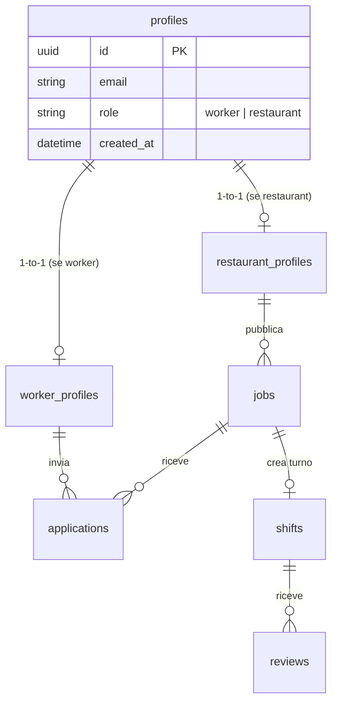

# DATABASE_MIGRATION_PLAN.md - Piano di Migrazione Supabase (Pupillo V2)

Questo documento definisce il piano di migrazione per il database **Supabase** di Pupillo V2, redatto sotto la direzione dell'agente **Code & Database Analyst**. Il piano mette a confronto lo schema originale di produzione con lo schema V2 e traccia una roadmap incrementale di migrazione sicura.

---

## 1. Descrizione dello Schema Database Attuale (Backup)

Il database originale si basa su un'architettura **PostgreSQL avanzata e centralizzata**:
* **Tipi ENUM**: 9 enum nativi (`app_role`, `announcement_status`, `application_status`, `shift_status`, `user_plan`, ecc.) che blindano i campi di stato.
* **Profili Unificati (`profiles`)**: Invece di dividere i profili in tre tabelle separate, lo schema di backup utilizza una singola tabella `public.profiles` denormalizzata in cui coesistono i campi dei lavoratori e dei ristoranti, controllati dal campo `primary_role`.
* **Tabelle Operative**:
  * `announcements` (annunci/turni di lavoro)
  * `applications` (candidature)
  * `shifts` (turni matched/confermati)
  * `reviews` e `required_reviews` (rating bilaterali)
  * `messages` (chat in tempo reale)
  * `credit_transactions` (fatturazione a crediti)

---

## 2. Elenco Tabelle Principali & Relazioni (V2)

Per Pupillo V2, ristrutturiamo lo schema per supportare **sia profili verticali separati** (maggiore manutenibilità nel monorepo MVP) che l'integrità del core di business.

### Relazioni Chiave:
* **`profiles` $\to$ `worker_profiles` / `restaurant_profiles`**: Relazioni 1-a-1 via chiave esterna `id` che punta a `profiles.id` con `on delete cascade`.
* **`restaurant_profiles` $\to$ `jobs`**: Relazione 1-a-Molti. Un ristorante può pubblicare molteplici annunci di turno.
* **`jobs` $\to$ `applications`**: Relazione 1-a-Molti. Ogni annuncio riceve le candidature dei lavoratori.
* **`worker_profiles` $\to$ `applications`**: Relazione 1-a-Molti. Un lavoratore può candidarsi a molteplici annunci.

---

## 3. Confronto Schemi: Backup vs Pupillo V2 Ideal Schema

| Elemento | Schema Backup (Originale) | Schema Ideale Pupillo V2 | Motivazione del Cambio |
| :--- | :--- | :--- | :--- |
| **Tabella Profili** | `profiles` (Tabella unica denormalizzata con 60+ colonne condizionali) | `profiles` (centrale) + `worker_profiles` & `restaurant_profiles` (tabelle verticali separate) | **Isolamento e Pulizia**: Separare le tabelle evita righe sparse di valori `NULL` (es. Partita IVA nulla per i lavoratori) e semplifica le policy RLS verticali e i form di onboarding Next.js. |
| **Tabella Turni** | `announcements` (con 50+ colonne) | `jobs` (struttura snella focalizzata sui parametri MVP del turno) | **Velocità MVP**: Riduce la complessità eliminando parametri avanzati post-MVP non necessari in questa v1 (come tatuaggi/piercings consentiti). |
| **Chat & Recensioni** | Presenti (`messages`, `reviews`) | Mantenute come entità core V2 | **Garanzia di matching**: Indispensabili per creare relazioni di fiducia bilaterali post-match. |

---

## 4. Impatto su Policy RLS & Trigger PostgreSQL

### A. RLS (Row Level Security)
* Spostando le anagrafiche su tabelle separate (`worker_profiles`, `restaurant_profiles`), le policy RLS diventano estremamente semplici da verificare:
  * Solo il lavoratore autenticato può inserire e modificare la propria riga in `worker_profiles` (`auth.uid() = id`).
  * Chiunque può visualizzare i profili per motivi di matching (`select` libera).
* Per i turni (`jobs`):
  * L'inserimento è protetto da un controllo incrociato con la tabella `profiles` per verificare che l'utente loggato abbia il ruolo `'restaurant'`.

### B. Trigger di Sincronizzazione (`handle_new_user`)
* Manteniamo la funzione SQL trigger `public.handle_new_user()` che intercetta la registrazione in `auth.users` e clona l'utente in `public.profiles`.
* **Novità V2**: Il trigger crea esclusivamente la riga in `public.profiles`. La riga di dettaglio in `worker_profiles` o `restaurant_profiles` viene creata in modo esplicito durante la compilazione del form di `/onboarding`.

---

## 5. Piano di Migrazione a Step (Safe & No-Loss)

Per applicare lo schema in modo sicuro su Supabase senza rischiare perdite di dati o collisioni:

### Step 1: Preparazione Ambiente
* Eseguire un backup completo dei dati presenti (tramite export JSON/SQL della dashboard).
* Abilitare l'estensione UUID: `create extension if not exists "uuid-ossp";`.

### Step 2: Creazione Tipi ENUM & Tabella `profiles`
* Eseguire il blocco SQL DDL che definisce i tipi ENUM e la tabella `public.profiles`.
* Caricare ed agganciare la funzione trigger `public.handle_new_user()` su `auth.users`.

### Step 3: Creazione Tabelle Profili Verticali
* Creare `public.worker_profiles` e `public.restaurant_profiles` con le relative foreign key a `profiles.id`.

### Step 4: Creazione Tabelle Core (`jobs`, `applications`, `shifts`, `reviews`)
* Creare le tabelle dei turni, delle candidature, dei turni confermati e delle recensioni, configurando i vincoli `on delete cascade`.

### Step 5: Attivazione RLS & Indici
* Eseguire i comandi `alter table ... enable row level security;`.
* Applicare le RLS policies descritte.
* Creare gli indici strutturali (`idx_jobs_restaurant_id`, `idx_applications_job_id`) per ottimizzare le prestazioni delle bacheche.
