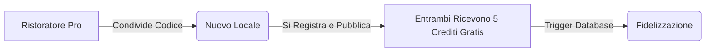

# GROWTH_STRATEGY.md - Modelli di Monetizzazione & Strategia di Crescita (Pupillo)

Questo documento definisce il modello commerciale, le logiche di monetizzazione, il pricing e le strategie di conversione per massimizzare la crescita di **Pupillo**. Le strategie qui descritte sono progettate per essere nativamente integrate con lo schema database reale ed il sistema di transazioni Stripe.

---

## 1. Modello di Monetizzazione di Pupillo

Pupillo non applica commissioni percentuali sul compenso del lavoratore (scelta che disincentiva l'uso del portale e crea attriti normativi). Adotta invece un **modello ibrido basato su Crediti e Abbonamenti SaaS** rivolto principalmente ai ristoratori, integrato da piccoli acquisti premium opzionali per i lavoratori.

```text
               RISTORATORI (B2B)
                      │
     ┌────────────────┴────────────────┐
     ▼                                 ▼
CREDITS (Pay-per-match)       SUBSCRIPTIONS (Piani SaaS)
- Consumati alla pubblicazione  - Canone flat mensile
  o all'accettazione extra.     - Sblocca annunci illimitati
- Pacchetti ricaricabili.       - Assistenza dedicata
```

### A. Ristoratori (B2B): I 3 Piani di Abbonamento
1. **Piano Free**:
   * Costo: 0€/mese.
   * Include: 1 annuncio di prova gratuito.
   * Target: Nuovi ristoratori per provare l'efficacia immediata di Pupillo.
2. **Piano Starter (Crediti)**:
   * Costo: Pay-per-use (acquisto di pacchetti crediti, es. 5 crediti per 25€).
   * Funzionamento: Ogni matching di successo (candidato accettato) consuma **1 Credito**.
   * Target: Piccoli locali, pub o osterie a gestione familiare che necessitano di extra solo nei weekend o per emergenze sporadiche.
3. **Piano Pro (Abbonamento Flat)**:
   * Costo: 79€/mese (canone fisso via Stripe).
   * Include: Pubblicazioni e match illimitati, priorità bacheca, e assistenza telefonica h24.
   * Target: Grandi ristoranti, catene, cocktail bar ad alto volume o società di catering con fabbisogno costante di personale.

### B. Lavoratori (B2C): Servizi Premium Opzionali
Il lavoratore utilizza la piattaforma in modo **gratuito al 100%** per cercare e candidarsi ai turni. Tuttavia, sono previsti due sblocchi premium opzionali:
* **Badge "Pro" / "Elite" Certificato**: Un piccolo costo una tantum (es. 9.99€) per sbloccare la verifica prioritaria dei documenti e mostrare una spilla dorata sul proprio profilo in bacheca, aumentando del 65% la probabilità di essere scelti.
* **Corso di Formazione / HACCP Express**: Partnership con enti formativi per ottenere o rinnovare l'HACCP direttamente in-app a prezzi scontati.

---

## 2. Ottimizzazione della Conversione (Frictionless CRO)

La frizione principale nelle piattaforme HoReCa è l'abbandono durante la fase di onboarding. Ottimizziamo il funnel tramite queste strategie:
* **Registrazione in 3 Secondi**: Inizialmente si chiedono solo Email e Password. L'utente entra subito ed esplora l'app (effetto "bacheca affollata") prima che gli vengano richiesti documenti e dettagli fisici.
* **Onboarding "A Tappe"**: Il lavoratore può compilare il profilo base (Nome/Cognome) in un istante. I documenti pesanti (carta d'identità, IBAN, CF) vengono richiesti **solo al momento della prima candidatura effettiva**.
* **SMS OTP Intelligente**: Verifica immediata del numero cellulare tramite form minimalista a 4 cifre per garantire la veridicità dei contatti prima di sbloccarli.

---

## 3. Il Loop Virale di Crescita (Referral & Codici Sconto)

Per crescere in modo organico senza budget pubblicitari proibitivi, Pupillo implementa un loop di passaparola strutturale:



* **Bonus "Presenta un Amico" (Referral)**:
  * Implementato direttamente tramite la funzione SQL `award_referral_credits()`.
  * Quando un ristoratore presenta un collega tramite codice promozionale, entrambi ricevono **5 Crediti gratuiti** non appena il nuovo locale completa il primo match con successo.
* **Codici Sconto Stagionali (`discount_codes`)**:
  * Offerte speciali mirate durante i picchi festivi (es. "NATALE26" sblocca il 20% di sconto sui pacchetti crediti) gestite tramite la tabella `discount_codes` e applicate istantaneamente in Stripe Checkout.
