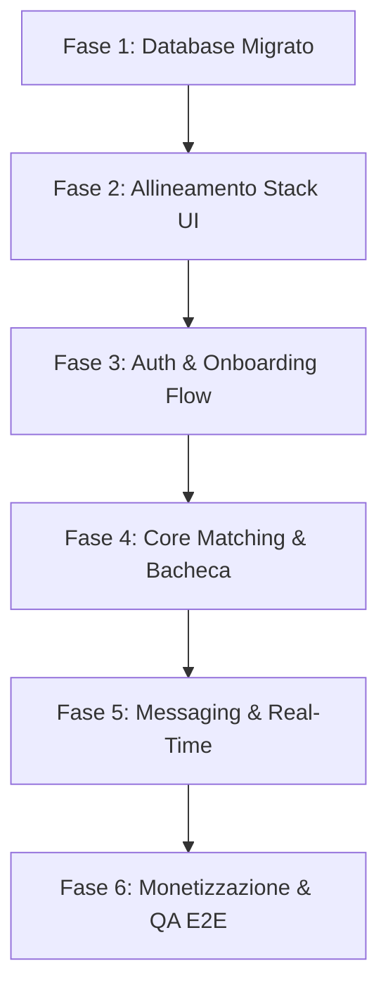

# RECONSTRUCTION_PLAN.md - Piano di Ricostruzione Tecnico (Pupillo V2)

Questo documento definisce la roadmap operativa, divisa in fasi logiche ed incrementali, per la ricostruzione completa ed orchestrata di **Pupillo V2**. Il piano sfrutta le analisi condotte dagli agenti specialisti su database, codebase, brand e crescita per garantire un'architettura indistruttibile ed un design d'avanguardia.

---

## 🗺️ Roadmap di Ricostruzione in 6 Fasi

---

## FASE 1: Iniezione Database & Validazione RLS
* **Obiettivo**: Ricostruire l'infrastruttura PostgreSQL su Supabase ereditando la maturità strutturale dell'app di backup.
* **Azioni Operative**:
  1. Esecuzione dei tipi `ENUM` personalizzati nel SQL Editor di Supabase.
  2. Creazione della tabella `profiles` unificata ed inserimento dei trigger automatici (`handle_new_user()`).
  3. Creazione delle tabelle verticali (`announcements`, `applications`, `shifts`, `reviews`, `messages`, `credit_transactions`).
  4. Applicazione degli indici ottimizzati (`idx_announcements_search`, `idx_messages_chat`) per supportare query ad alte prestazioni.
  5. Abilitazione delle RLS policies separate ad hoc (connessione `with check` su status e ID utente).

---

## FASE 2: Allineamento Frontend & Integrazione UI System
* **Obiettivo**: Allineare il monorepo con Next.js App Router ed integrare i parametri visuali definiti nella direzione grafica.
* **Azioni Operative**:
  1. Configurazione delle variabili CSS di Tailwind V4 in `frontend/styles.css` per impostare il tema scuro profondo, e i colori accentati HSL (`Teal`, `Emerald`, `Indigo`).
  2. Importazione ed associazione dei Google Fonts **Outfit** (titoli) e **Inter** (testo/form).
  3. Installazione e configurazione delle librerie core esterne nel pacchetto frontend (`@supabase/ssr`, `lucide-react`, `leaflet`, `react-leaflet`, `stripe`).
  4. Creazione delle utility UI primitive (cards glassmorphism, pulsanti con micro-interazioni neon e ombre scalabili).

---

## FASE 3: Autenticazione & Onboarding Flow Multi-Step
* **Obiettivo**: Reingegnerizzare il funnel d'ingresso riducendo al minimo il tasso di abbandono iniziale.
* **Azioni Operative**:
  1. Sviluppo della rotta `/register` focalizzata unicamente sulle credenziali e la scelta ruolo (Lavoratore vs Ristoratore).
  2. Reingegnerizzazione di `/onboarding` in una pagina multi-step dinamica:
     * **Step 1 Lavoratore**: Dati anagrafici e recapiti cellulare con invio OTP.
     * **Step 2 Lavoratore**: Skills, biografia ed esperienze professionali HoReCa.
     * **Step 3 Lavoratore**: Caricamento sicuro dei documenti d'identità e codice fiscale su Supabase Storage.
     * **Step 1 Ristoratore**: Dati commerciali, Ragione Sociale, Partita IVA.
     * **Step 2 Ristoratore**: Sede, Città, descrizione del locale e logistica.
  3. Sviluppo di `/login` integrando il controllo di presenza del profilo per smistamento o blocco onboarding.

---

## FASE 4: Bacheca Annunci & Logica Matching
* **Obiettivo**: Creare l'interfaccia di incontro tra offerta extra e domanda, implementando il matching transazionale.
* **Azioni Operative**:
  1. Sviluppo della bacheca `/browse` per i lavoratori extra, ordinata cronologicamente con filtri avanzati per ruolo e tariffa oraria.
  2. Implementazione della mappa interattiva (Leaflet) su `/mappa` per tracciare geograficamente i turni aperti sul territorio.
  3. Sviluppo dell'annuncio singolo `/announcements/$id` per candidarsi istantaneamente con un click.
  4. Sviluppo del modal ristoratore `/announcements/new` (Wizard) per pubblicare i turni specificando il dress-code e i vincoli d'estetica.
  5. Sviluppo dell'azione di matching: accettare un candidato crea la riga in `shifts`, rifiuta gli altri e visualizza i telefoni reciproci.

---

## FASE 5: Messaggistica in Tempo Reale & Notifiche
* **Obiettivo**: Sbloccare lo scambio rapido di informazioni operative pre/post turno.
* **Azioni Operative**:
  1. Integrazione di Supabase Realtime all'interno della rotta `/messages` e `/messages/$id` per una chat istantanea e reattiva.
  2. Impostazione delle notifiche push ed email in-app collegate alle modifiche degli stati (`application_status`, `shift_status`).
  3. Sviluppo dell'area Recensioni obbligatorie (`reviews`) post-completamento turno per incrementare la reputazione di ristoranti e lavoratori.

---

## FASE 6: Monetizzazione (Stripe) & Testing QA E2E
* **Obiettivo**: Collegare Stripe Billing e verificare la tenuta del sistema sotto stress.
* **Azioni Operative**:
  1. Integrazione delle rotte Stripe Checkout per l'acquisto di pacchetti crediti o abbonamenti Starter/Pro.
  2. Configurazione della funzione SQL di Referral per l'accredito dei bonus di invito amici.
  3. Esecuzione della suite completa di test descritta in `QA_TEST_PLAN.md` per escludere vulnerabilità o bug.
