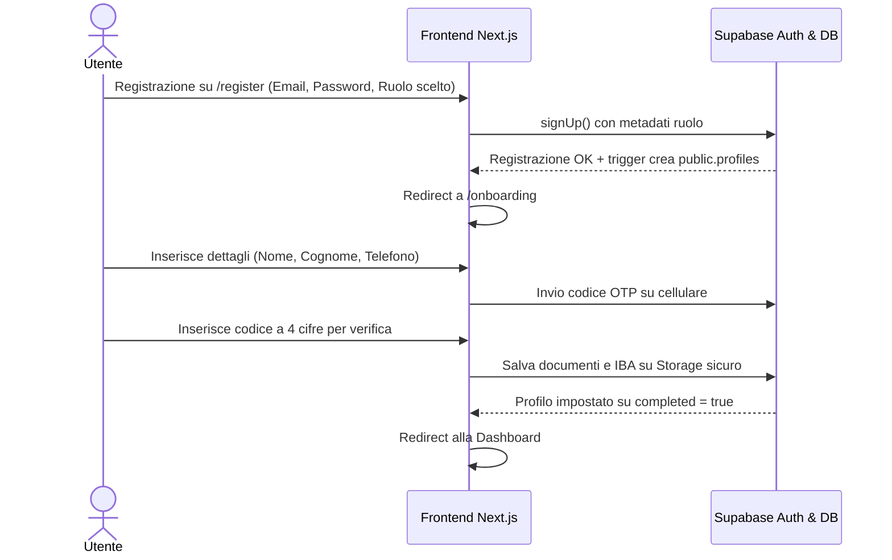
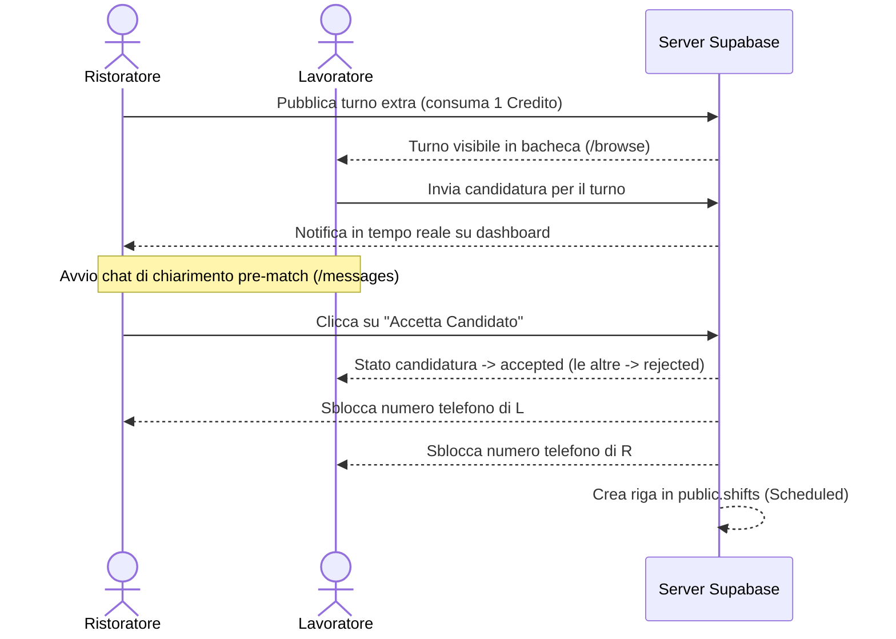

# SPEC_DEV.md - Specifiche di Prodotto e Sviluppo (Pupillo V2)

Questo documento definisce le specifiche di prodotto, l'architettura tecnica e i flussi funzionali per la ricostruzione di **Pupillo V2**. La piattaforma connette gestori di locali ristorativi (**Ristoratori**) con risorse operative a chiamata (**Lavoratori Extra**) per la copertura di turni saltuari in tempo reale.

---

## 1. Visione del Prodotto & Posizionamento (V2)

Pupillo V2 si propone come **l'ecosistema leader per il lavoro extra meritocratico e autonomo nel settore HoReCa**. 
* **Linguaggio & Tono**: Abbandona il rigido formalismo corporativo per parlare in modo diretto, energetico, motivante e ambizioso sia a gestori che lavoratori di talento.
* **Proposta di Valore**:
  * **Per il Lavoratore**: "Lavora alle tue condizioni." Autonomia nel decidere tariffe, giorni e luoghi di lavoro, supportati da una reputazione certificata.
  * **Per il Ristoratore**: "Copri i turni in un flash." Matching istantaneo con profili verificati, zero no-shows e nessuna intermediazione burocratica lenta.

---

## 2. Target Utenti & Ruoli

### A. Lavoratore Extra (`worker`)
* **Profilo**: Camerieri, bartender, cuochi, lavapiatti, runner e baristi (principalmente Gen Z e Millennials).
* **Friction Point risolti**: Paga non trasparente, mancanza di meritocrazia visibile, zero flessibilità.
* **Status reputazionali**: Badge *Basic*, *Pro* o *Elite* in base al punteggio e ai turni completati.

### B. Ristoratore / Gestore (`restaurant`)
* **Profilo**: Proprietari di bistrot, cocktail bar, pub, hotel e società di catering.
* **Friction Point risolti**: Assenze improvvise del personale, inaffidabilità ("no-shows"), tempistiche burocratiche.
* **Monetizzazione**: Consumo crediti ad inserimento/match e abbonamenti Premium su Stripe.

### C. Amministratore (`admin`)
* **Profilo**: Supporto clienti Pupillo.
* **Compiti**: Verifica dei documenti dei lavoratori, arbitraggio incidenti (no-shows) ed erogazione rimborsi.

---

## 3. Flussi di Business End-to-End (E2E)

### A. Funnel di Registrazione & Onboarding


### B. Flusso di Match, Chat e Sblocco Contatti


---

## 4. Schema Database DDL (Supabase PostgreSQL)

Lo schema database V2 eredita la robustezza e la capillarità del backup, strutturandosi tramite i seguenti componenti:

### A. Tipi ENUM
```sql
create type public.app_role as enum ('admin', 'restaurant', 'worker');
create type public.account_status as enum ('active', 'pending', 'suspended');
create type public.announcement_status as enum ('draft', 'active', 'expired', 'assigned', 'cancelled', 'completed');
create type public.application_status as enum ('pending', 'interested', 'not_interested', 'counter_offer', 'accepted', 'rejected', 'expired');
create type public.shift_status as enum ('scheduled', 'completed', 'no_show', 'cancelled');
create type public.tariff_type as enum ('hourly', 'flat');
create type public.credit_tx_kind as enum ('purchase', 'grant', 'consume', 'refund', 'plan_bonus');
create type public.user_plan as enum ('free', 'credits', 'premium', 'pro', 'business');
create type public.experience_level as enum ('junior', 'intermediate', 'senior');
create type public.worker_badge as enum ('basic', 'pro', 'elite');
```

### B. Tabella Profili (`public.profiles`)
```sql
create table public.profiles (
  id uuid references auth.users on delete cascade primary key,
  email text,
  full_name text,
  phone text,
  bio text,
  avatar_url text,
  primary_role public.app_role default 'worker'::public.app_role not null,
  secondary_roles text[] default '{}'::text[],
  profile_completed boolean default false not null,
  created_at timestamp with time zone default now() not null,
  updated_at timestamp with time zone default now() not null,
  
  -- Campi specifici per Lavoratore (Worker)
  birth_date date,
  experience_years integer default 0 check (experience_years >= 0),
  experience_level public.experience_level,
  hourly_rate numeric(6,2),
  skills text[] default '{}'::text[],
  rating_avg numeric(3,2) default 5.00,
  reviews_count integer default 0,
  completed_shifts integer default 0,
  no_shows integer default 0,
  reliability_pct integer default 100 check (reliability_pct between 0 and 100),
  
  -- Campi specifici per Ristoratore (Restaurant)
  business_name text,
  company_name text,
  vat_number text,
  address text,
  city text,
  province text,
  postal_code text,
  
  -- Monetizzazione & Credits
  plan public.user_plan default 'free'::public.user_plan not null,
  credits integer default 0 not null check (credits >= 0),
  account_status public.account_status default 'active'::public.account_status not null
);
```

### C. Tabella Annunci (`public.announcements`)
```sql
create table public.announcements (
  id uuid default gen_random_uuid() primary key,
  restaurant_id uuid references public.profiles(id) on delete cascade not null,
  role text not null,
  service_date date not null,
  service_time time without time zone not null,
  duration_hours numeric default 4 not null check (duration_hours > 0),
  tariff_type public.tariff_type default 'hourly'::public.tariff_type not null,
  tariff_amount numeric not null check (tariff_amount > 0),
  location_address text not null,
  city text,
  province text,
  status public.announcement_status default 'active'::public.announcement_status not null,
  notes text,
  required_skills text[] default '{}'::text[],
  dress_code_notes text,
  created_at timestamp with time zone default now() not null,
  expires_at timestamp with time zone default (now() + '7 days'::interval) not null
);
```

### D. Tabella Candidature (`public.applications`)
```sql
create table public.applications (
  id uuid default gen_random_uuid() primary key,
  announcement_id uuid references public.announcements(id) on delete cascade not null,
  worker_id uuid references public.profiles(id) on delete cascade not null,
  restaurant_id uuid references public.profiles(id) on delete cascade not null,
  status public.application_status default 'pending'::public.application_status not null,
  proposed_tariff numeric,
  response_deadline timestamp with time zone default (now() + '24 hours'::interval) not null,
  created_at timestamp with time zone default now() not null,
  updated_at timestamp with time zone default now() not null,
  unique(announcement_id, worker_id)
);
```

### E. Tabella Turni Confermati (`public.shifts`)
```sql
create table public.shifts (
  id uuid default gen_random_uuid() primary key,
  announcement_id uuid references public.announcements(id) on delete cascade not null,
  restaurant_id uuid references public.profiles(id) on delete cascade not null,
  worker_id uuid references public.profiles(id) on delete cascade not null,
  shift_date date not null,
  hours numeric not null check (hours > 0),
  amount numeric not null check (amount >= 0),
  status public.shift_status default 'scheduled'::public.shift_status not null,
  completed_at timestamp with time zone,
  created_at timestamp with time zone default now() not null
);
```

---

## 5. Specifiche dei Componenti Frontend V2

* **`bg-slate-950` Theme Variable**: Ogni pagina deve adottare lo sfondo dark profondo e pulito.
* **Componente MapView (Leaflet)**: Presente in `/mappa` per geo-referenziare gli annunci aperti.
* **Pulsanti con Micro-Interazioni**:
  * Stato standard: Gradienti Teal $\to$ Emerald.
  * Stato Hover: `scale-102`, bagliore neon ombreggiato.
  * Stato Active: `scale-98` (feedback tattile).
* **Bottom Sheets (Radix / Vaul)**: Tutte le schede di dettaglio sui dispositivi mobili scivolano dal basso.
