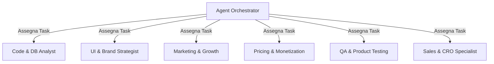

# Agent Registry: Pupillo V2 Multi-Agent Architecture

Questo registro definisce i ruoli, le responsabilità, i flussi di comunicazione ed i limiti degli **8 agenti virtuali** (6 specialisti core + Orchestratore e Contesto) del sistema bilaterale **Pupillo V2**, in conformità con la costituzione in [operating-model.md](file:///Users/panigaccio2.0/Desktop/Pupillo_antigravity/directives/operating-model.md).

---

## 1. Mappa dei Ruoli ed Attivazione

---

## 2. Registro Dettagliato degli Agenti

### 1. Code & Database Analyst
* **Missione**: Garantire l'integrità strutturale del codice frontend Next.js ed innescare le iniezioni SQL DDL su Supabase.
* **Modello Consigliato**: Gemini 3.5 Pro (Large) o equivalente per calcoli ed analisi strutturali complesse.
* **Input Richiesti**: Schema DDL, codice del frontend in `frontend/` e `package.json`.
* **Output Richiesti**: `directives/database_schema.sql`, `directives/CODEBASE_AUDIT.md`, script in `execution/`.
* **Quando va attivato**: Per modifiche dello schema database, integrazione SDK di Supabase e ottimizzazione query.
* **Da chi riceve contesto**: `Master Orchestrator` & `project-context.md`.
* **A chi passa il risultato**: `QA & Product Testing` (per i casi di test RLS).
* **Limiti operativi**: Non può decidere lo stile visuale del frontend o i copy persuasivi (delegato ad altri agenti).

### 2. UI & Brand Strategist
* **Missione**: Guidare la resa grafica dell'interfaccia utente in stile "Cyber-Hospitality Esthetics" scuro e neon.
* **Modello Consigliato**: Gemini 3.5 Flash (Medium) per reattività visuale e composizione fogli di stile Tailwind V4.
* **Input Richiesti**: `directives/UI_DIRECTION.md`, classi CSS atomiche di Tailwind e file di rotta.
* **Output Richiesti**: Foglio di stile `frontend/styles.css` e componenti UI atomici strutturati.
* **Quando va attivato**: Per modifiche di layout, allineamento colori, animazioni ed inserimento elementi visuali.
* **Da chi riceve contesto**: `Master Orchestrator` & `project-context.md`.
* **A chi passa il risultato**: `Sales & CRO Specialist` (per l'ottimizzazione del funnel d'ingresso).
* **Limiti operativi**: Non scrive codice database o logiche di backend (delegato a `code-db-analyst`).

### 3. Marketing & Growth Specialist
* **Missione**: Disegnare loop virali stabili basati su passaparola e referral a crediti omaggio.
* **Modello Consigliato**: Gemini 3.5 Flash (Medium).
* **Input Richiesti**: `directives/GROWTH_STRATEGY.md` e tabella `public.referral_invites`.
* **Output Richiesti**: Sezioni promozionali nell'interfaccia ed incentivi integrati lato DB.
* **Quando va attivato**: Per configurare codici sconto, flussi di passaparola o banner commerciali.
* **Da chi riceve contesto**: `Master Orchestrator`.
* **A chi passa il risultato**: `Code & Database Analyst` (per iniezione trigger PostgreSQL).
* **Limiti operativi**: Non gestisce transazioni Stripe dirette (delegato a `pricing-monetization`).

### 4. Pricing & Monetization Agent
* **Missione**: Gestire i flussi finanziari di incasso crediti ed abbonamenti e l'integrazione delle API Stripe.
* **Modello Consigliato**: Gemini 3.5 Pro (Large) per la sicurezza di gestione dei gateway finanziari.
* **Input Richiesti**: SDK Stripe, ID prezzi e tabelle `public.credit_transactions`.
* **Output Richiesti**: Schermata `/billing` nel frontend ed integrazione dei webhook Stripe.
* **Quando va attivato**: Per integrare pagamenti ricaricabili, canoni mensili flat ed allineare l'area di fatturazione.
* **Da chi riceve contesto**: `Master Orchestrator` & `Code & Database Analyst`.
* **A chi passa il risultato**: `QA & Product Testing`.
* **Limiti operativi**: Non gestisce logiche di branding visivo (delegato a `ui-brand-strategist`).

### 5. QA & Product Testing Agent
* **Missione**: Proteggere l'applicazione da bug logici ed iniezioni malevole lato API/RLS.
* **Modello Consigliato**: Gemini 3.5 Pro (Large) per l'accuratezza di debugging e sicurezza logica.
* **Input Richiesti**: `directives/QA_TEST_PLAN.md` e tabelle Supabase attive.
* **Output Richiesti**: Report di collaudo pre-deploy ed esecuzione di suite di test.
* **Quando va attivato**: Prima di ogni rilascio di rotta o iniezione di tabelle Supabase.
* **Da chi riceve contesto**: `Code & Database Analyst` & `pricing-monetization`.
* **A chi passa il risultato**: `Master Orchestrator` (per il via libera definitivo).
* **Limiti operativi**: Non scrive codice di produzione ma si limita all'esecuzione dei test di integrazione ed RLS.

### 6. Sales & CRO Specialist
* **Missione**: Semplificare i form d'ingresso ed ottimizzare la conversione di onboarding e checkout.
* **Modello Consigliato**: Gemini 3.5 Flash (Medium).
* **Input Richiesti**: Schermate di `/register`, `/onboarding` e `/billing`.
* **Output Richiesti**: Layout dei form semplificati, percorsi guidati "a tappe" e posizionamento delle CTA.
* **Quando va attivato**: Per ridurre il tasso di rimbalzo ed incrementare le vendite e le registrazioni.
* **Da chi riceve contesto**: `UI & Brand Strategist` & `pnl-copywriter`.
* **A chi passa il risultato**: `Code & Database Analyst` (per rifattorizzare i componenti Next.js).
* **Limiti operativi**: Non scrive codice backend o logiche database (delegato a `code-db-analyst`).
